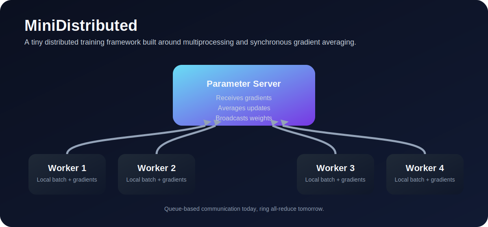

# MiniDistributed

A small, readable distributed-training playground built around multiprocessing.



## Install

```bash
pip install mini-distributed-training-framework
```

For local development:

```bash
git clone https://github.com/vaibhavviji2809-eng/Mini-Distributed-Training-Framework.git
cd Mini-Distributed-Training-Framework
pip install -e ".[dev]"
```

## Quick Start

```python
from MiniDistributed import DistributedTrainer, TinyGPT

model = TinyGPT()
trainer = DistributedTrainer(model=model, workers=4)
trainer.train()
```

## TinyGPT Example

```python
from MiniDistributed import DistributedTrainer, TinyGPT

model = TinyGPT()
trainer = DistributedTrainer(
    model=model,
    workers=4,
    batch_size=32,
    steps_per_worker=24,
    learning_rate=0.05,
)
result = trainer.train()
print(result["final_loss"])
```

## Single-Worker Example

```python
from MiniDistributed.examples.linear_regression import LinearRegressionModel, make_dataset
from MiniDistributed.trainer.trainer import Trainer

inputs, targets = make_dataset()
model = LinearRegressionModel()
trainer = Trainer(model=model, learning_rate=0.05, batch_size=32, epochs=12)
trainer.train(inputs, targets)
```

## What Is Included

- Queue-based communication layer
- Synchronous parameter server
- Worker processes with sharded data
- Checkpoint save/load helpers
- TinyGPT toy model for distributed demos
- Single-worker trainer and runnable examples
- GitHub Actions test workflow

## Project Layout

- `core/` process coordination, communication, checkpointing
- `trainer/` single-worker and distributed trainers
- `models/` TinyGPT toy model
- `examples/` runnable demos
- `docs/` design notes and roadmap
- `dashboard/` future observability UI notes

## Example Commands

```bash
python -m MiniDistributed.examples.linear_regression
python -m MiniDistributed.examples.mnist
python -m MiniDistributed.examples.tiny_gpt
python benchmarks/benchmark.py
```

The benchmark script compares a single-worker training pass with an in-process
distributed data-parallel step. Pass custom worker counts if you want to scale
the comparison:

```bash
python benchmarks/benchmark.py --workers 2 4 8
```

## Advanced Features

- Ring all-reduce: `sync_method="ring"` uses a ring-style reduction path.
- Gradient compression: set `compression="fp16"` to shrink gradient payloads in transit.
- Checkpoint resume: set `checkpoint_path=...` and `resume_from_checkpoint=True`.
- Dashboard metrics: trainer results include `metrics` with loss, throughput, latency, and worker health.
- Fault tolerance: enable `fault_tolerant=True` to restart from the latest checkpoint after a worker failure.

Example:

```python
trainer = DistributedTrainer(
    model=TinyGPT(),
    workers=4,
    checkpoint_path="checkpoints",
    resume_from_checkpoint=True,
    sync_method="ring",
    compression="fp16",
    fault_tolerant=True,
)
```
